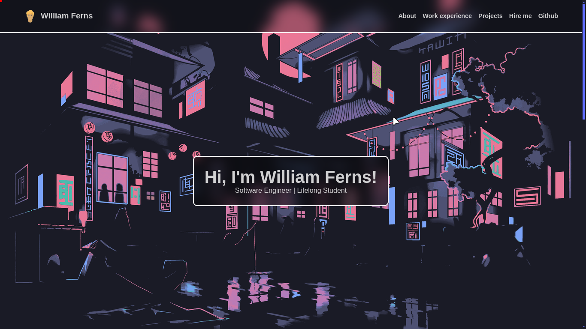
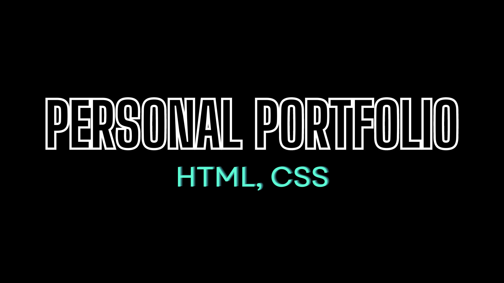

# My Personal Portfolio

A simple personal portfolio, made with HTML and CSS, showcasing my recent projects and skills. Feel free to check <a href="https://williamferns.org" target="_blank">my portfolio</a> out, and give feedback on what I can improve if you like. If you want to see a quick showcase video of the portfolio, <a href="https://www.youtube.com/watch?v=DE21IevfJ7A" target="_blank">click here</a>. 

## Technologies:
1. HTML
2. CSS

## Project Motive:
Having an optimized Github profile is great, but having a personal portfolio website to showcase your skills and work experience is even better. As a developer, it is a must to have a personal portfolio.

## Contributions:
If you really like the portfolio, and you see something you can improve, feel free to **fork** this repo, make your changes, and submit a pull request. If you see any spelling mistake on this markdown file, or on the website, please make an **issue**, so that I can fix it. Thanks. Recommendations on how I can improve it would be great.

## What I learnt from making this project:
1. HTML
2. CSS
3. Mobile Responsiveness

Once I learn Javascript from freeCodeCamp's Curriculum, I will update this project, to have a burger icon on the header for mobile, to show the nav items. Feel free to make a pull request if you are up for the challenge.

## License:
This project is under the MIT license. Feel free to do whatever you wnat with it, I really don't care.

## Conclusion:
If you are someone that are looking to hire a developer, whether it is freelancing work, an internship, or a full time position, feel free to reach out to me with one of the following channels: 

  
  
  &nbsp;&nbsp;&nbsp;

